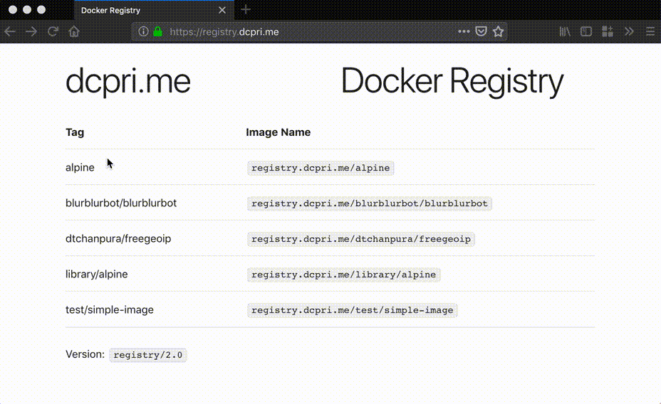

# Simple Docker Registry Frontend

## Introduction

This project aims to have a simple frontend user interface for listing down
docker images and available tags to it.

This uses following parts:
* [sveltejs/svelte](https://github.com/sveltejs/svelte)
* [docker/distribution](https://github.com/docker/distribution)
* [docker-registry](https://docs.docker.com/registry/spec/api/)

## Building

* Clone the code
* Change parameters in src/main.js like
  * title
  * subtitle
  * app_title

* Install dependencies
  ```bash
  npm install
  ```

* Build code
  ```bash
  npm run build
  ```

* Development live-reload
  ```bash
  npm run dev
  ```

## Demo


Link to video: [here](https://vimeo.com/308584485).

## License

This project is distributed under [The MIT License](LICENSE).
