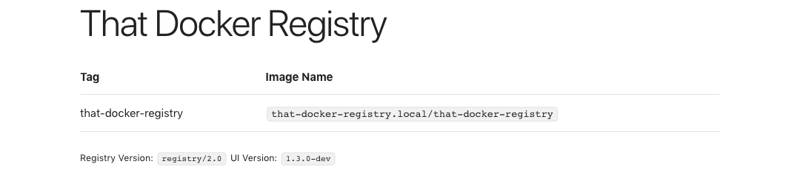
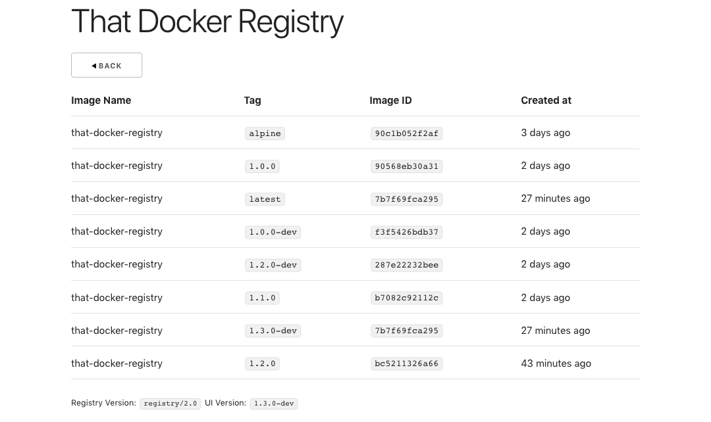

# Simple Docker Registry Frontend

## Introduction

This project aims to have a simple frontend user interface for listing down
docker images and available tags to it.

This uses following parts:
* [sveltejs/svelte](https://github.com/sveltejs/svelte)
* [docker/distribution](https://github.com/docker/distribution)
* [docker-registry](https://docs.docker.com/registry/spec/api/)
* [dhg/Skeleton](https://github.com/dhg/Skeleton/)

## Building

* Clone the code
* Change parameters in src/main.js like
  * title
  * subtitle
  * appTitle

* Install dependencies
  ```bash
  npm install
  ```

* Build code
  ```bash
  npm run build
  ```

* Development live-reload
  ```bash
  npm run dev
  ```

## Building with Docker

The project contains a Makefile which has all the required commands.

* `make build` will create a docker image with
that-docker-registry.local/that-docker-registry:latest image.

* `make compose` will run `docker-compose up` which will create two
containers one with registry and other with this project frontend.

* `make clean` can be useful for cleaning all intermediate images
which are built as a part of building the final image.

> While using docker-compose if you're asked for username and password use
> admin:ThatRegistryAdmin which is the default set in nginx.htpasswd
## Screenshots





Link to video: [here](https://vimeo.com/308921019).

## License

This project is distributed under [The MIT License](LICENSE).
